# lab6
## part 1
this is the code of the requests: 
get of all cinema:
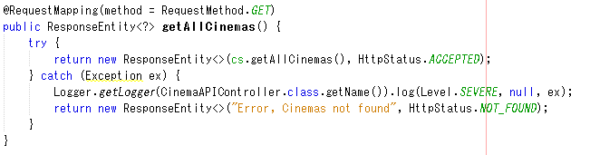  
and this is the result 
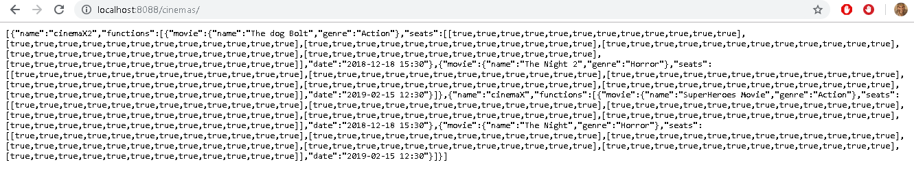
get of a specific cinema, with the name of the cinema the request return the cinema, if the cinema isn't exist, the user see the error not found.

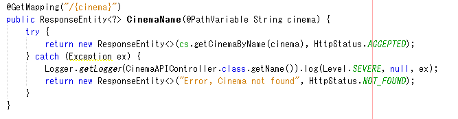

and this is the result of a success request

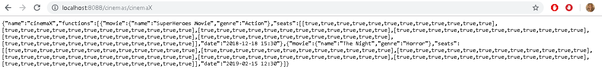

get whit the name of the cinema and the date in format "YYYY-MM-DD:"

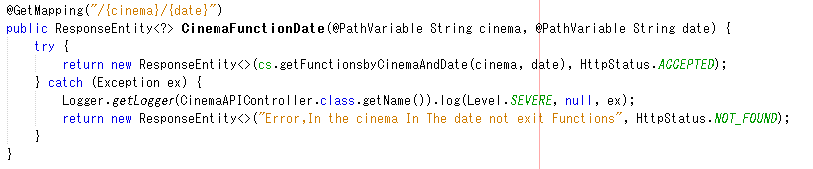

and this is the result of a success request

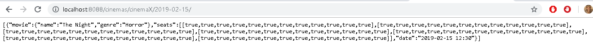

get whit the name of the cinema and the date in format "YYYY-MM-DD HH:MM:" and the name of the respective movie.

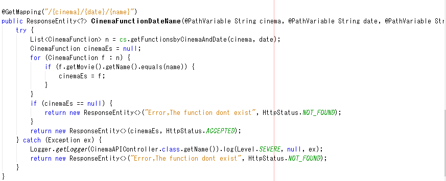

and this is the result of a success request

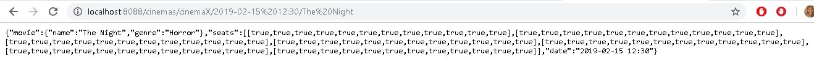

## part 2

This is the request post in de code, this is for add a function in the especific cinema

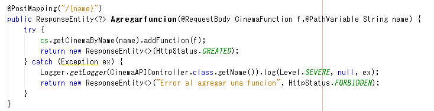

for test the request post is working, i use the complement of google chroome postman, in the following picture we can se the jason that I want to add

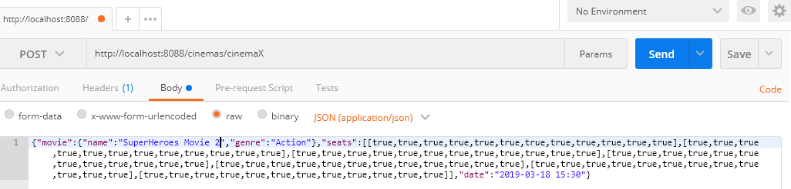

After that, we can see that in the respective path the object jason is add

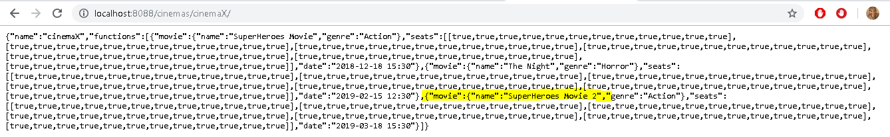

And this is the implement of the request put

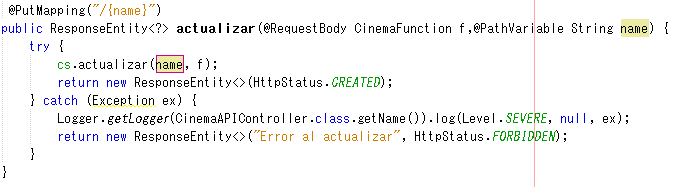

fist, this is the put update a existing function

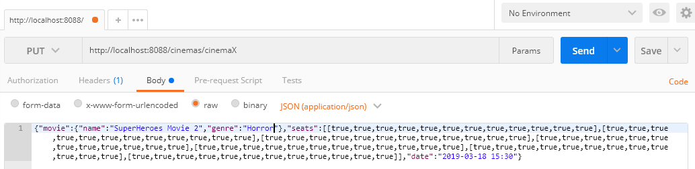

we can see in the respective path, the genre of the movie is changed.

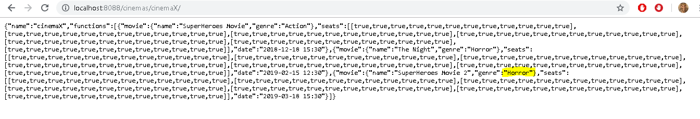

after that, this is the second use of the put

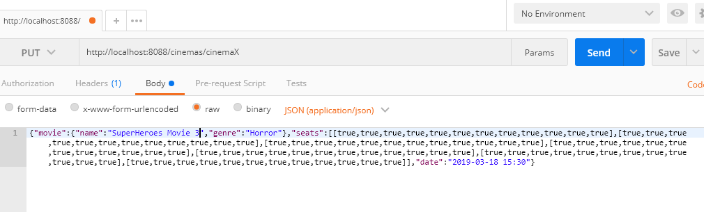

we can see that the request put craated a especific function.

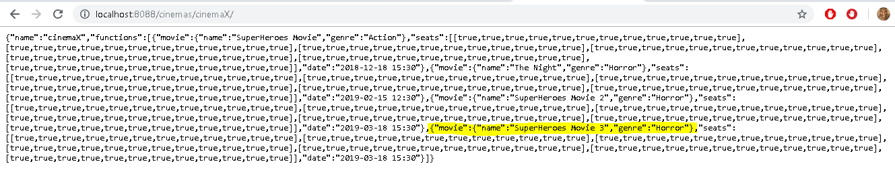

